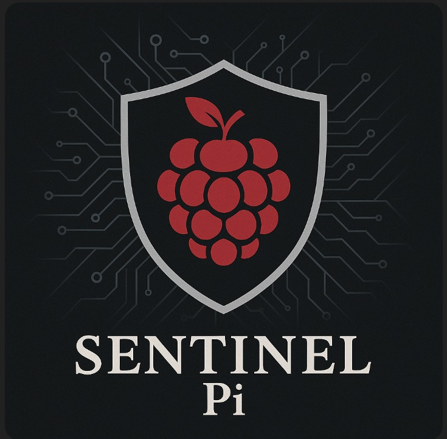

---
# Sentinel Pi
### Sentinel PI

 El aumento de los ciberataques a nivel mundial ha generado la necesidad urgente de contar con mecanismos de detección temprana que permitan mitigar riesgos y reforzar la seguridad en redes y sistemas críticos. En este contexto surge Sentinel Pi, un proyecto innovador diseñado como un honeypot inteligente basado en Raspberry Pi, cuyo propósito principal es actuar como una herramienta de bajo costo, accesible y adaptable para la detección temprana de amenazas informáticas. Este sistema busca no solo identificar y registrar intentos de intrusión, sino también ofrecer un entorno de análisis que permita comprender mejor los patrones de ataque y, a partir de ello, fortalecer la ciberdefensa de instituciones y organizaciones que requieran un monitoreo constante.

 La arquitectura de Sentinel Pi está pensada de manera modular y escalable. En su núcleo, la Raspberry Pi funciona como un honeypot capaz de simular servicios comunes como SSH, FTP o Telnet, con el objetivo de atraer a potenciales atacantes y recopilar información sobre los intentos de acceso no autorizados. Todos los registros generados son procesados mediante una API centralizada desarrollada en Spring Boot, que asegura un flujo estructurado de datos hacia una base de datos confiable. Este enfoque permite manejar información sensible de manera segura y ordenada, garantizando la integridad de los registros y la consistencia de los eventos capturados.

 Una de las características diferenciadoras de Sentinel Pi es su enfoque en la visualización distribuida de datos. Además de la interfaz web, el sistema incluye una aplicación desarrollada en Kotlin para Smart TV, lo que permite a los equipos de seguridad consultar de forma inmediata las métricas más relevantes en entornos de trabajo colaborativo o salas de monitoreo. De esta manera, los datos obtenidos del honeypot no permanecen ocultos en registros técnicos, sino que son expuestos como herramientas estratégicas para la toma de decisiones.

 El proyecto también contempla requisitos no funcionales clave como la escalabilidad mediante contenedores en Docker Compose, la comunicación segura usando HTTPS y JWT, la portabilidad hacia diferentes dispositivos y navegadores, y la tolerancia a fallos frente a desconexiones o interrupciones temporales. Estos atributos garantizan que Sentinel Pi no sea una solución rígida, sino un sistema adaptable a diversos contextos institucionales, desde universidades hasta pequeñas empresas o dependencias gubernamentales que buscan robustecer su postura de seguridad sin invertir en costosas infraestructuras.

 Sentinel Pi se apoya en prácticas ágiles y herramientas de modelado como UML, DFD y Redes de Petri, que han permitido definir de manera clara los casos de uso, los componentes principales y la interacción entre módulos. Asimismo, la documentación asociada al proyecto sigue los lineamientos del estándar IEEE 830, asegurando que los requisitos, restricciones y escenarios futuros estén formalmente especificados y disponibles para la comunidad.
 

## LOGOTIPOS

<table>
   <td>Logo de la Aplicacion</td>
   <td>Logo de empresa</td>
  <tr>
    <td>    </td>
    <td>    </td>
   
  </tr>
 
</table>

### DESCRIPCION

Sentinel Pi es un sistema de ciberseguridad basado en Raspberry Pi que funciona como un honeypot inteligente, diseñado para la detección temprana de amenazas y el análisis de intentos de intrusión. Su objetivo es proporcionar una solución accesible, escalable y adaptable que permita a instituciones, empresas y organizaciones contar con una primera línea de defensa contra ciberataques.

El proyecto combina diferentes tecnologías en un ecosistema integral:

En la capa de detección, Raspberry Pi emula servicios comunes como SSH, FTP o HTTP, atrayendo posibles atacantes en un entorno controlado y seguro.

En la capa de procesamiento, los eventos capturados son enviados a una API central desarrollada en Java con Spring Boot, donde se procesan, validan y almacenan en una base de datos como MongoDB o MySQL.

 En la capa de análisis y visualización, se utilizan herramientas como Python para análisis de datos y un frontend en React con TailwindCSS que permite monitorear en tiempo real los ataques registrados, así como explorar estadísticas históricas mediante gráficos interactivos.

 Se desarrolló una aplicación para Smart TV en Kotlin, que facilita la consulta de datos de seguridad en pantallas inteligentes, pensando en centros de monitoreo y salas de control.

 El proyecto también integra un componente de monitoreo y visualización avanzada con Grafana, permitiendo que los administradores puedan correlacionar los intentos de intrusión con métricas de red y comportamiento en tiempo real. La arquitectura está soportada en contenedores Docker, lo que facilita la escalabilidad, la portabilidad y la implementación modular en distintos entornos.

 Sentinel Pi no solo busca detectar ataques, sino también convertirse en una herramienta educativa y de investigación, brindando información sobre patrones de ataque, vectores de intrusión más utilizados y métodos de evasión empleados por ciberdelincuentes. Con esta propuesta, se fomenta una cultura de ciberseguridad más sólida, accesible y aplicada a escenarios reales, aportando valor tanto a pequeñas organizaciones como a instituciones de gran escala.

---

### PLANTEAMIENTO DEL PROBLEMA

Sentinel Pi es un sistema honeypotimplementado sobre Raspberry Pi, diseñado para detectar y registrar intentos de intrusión, analizar amenazas con Python, y visualizarlas mediante un panel web en React y una app para Smart TV con Kotlin. Este proyecto combina bajo costo, portabilidad y escalabilidad para ofrecer una solución accesible en entornos de ciberseguridad.

 La arquitectura del sistema se centra en la Raspberry Pi como dispositivo principal, simulando servicios vulnerables para atraer atacantes y recopilar datos de sus actividades. Estos registros son enviados a una API desarrollada en Spring Boot, que centraliza la información, la almacena en bases de datos seguras y permite el análisis posterior. El uso de contenedores Docker y un diseño modular asegura que el sistema pueda adaptarse fácilmente a distintas instituciones sin comprometer su funcionamiento.

 El panel web en React proporciona visualización en tiempo real de intentos de acceso, estadísticas históricas y patrones de ataque, utilizando librerías de gráficos como Recharts. Por su parte, la aplicación en Smart TV, desarrollada en Kotlin, está orientada a salas de monitoreo, facilitando la supervisión colaborativa.

 En conjunto, Sentinel Pi democratiza la ciberseguridad, brindando a universidades, empresas y gobiernos una herramienta práctica, flexible y confiable para fortalecer su defensa digital.

---

### PROPUESTA DE SOLUCION

En respuesta al creciente número de ciberataques que amenazan diariamente la integridad de empresas, instituciones y servicios públicos, se plantea el desarrollo de Sentinel Pi, una solución práctica, accesible y orientada a la detección temprana de posibles intrusiones mediante el uso de dispositivos Raspberry Pi configurados como honeypots personalizados. Este enfoque busca ofrecer una herramienta tangible para monitorear y analizar el comportamiento de posibles atacantes antes de que logren comprometer activos críticos, reforzando así la seguridad en infraestructuras tecnológicas con bajo costo de implementación.

 El proyecto contempla la creación de una plataforma web en React y una aplicación para dispositivos inteligentes, incluyendo Smart TV con Kotlin, que permitirán la visualización en tiempo real de los intentos de intrusión captados por el honeypot. Estos entornos ofrecerán reportes interactivos y estadísticas generadas con Python y librerías de análisis de datos, facilitando la comprensión de patrones de ataque, su frecuencia y los vectores más comunes utilizados por los atacantes.

 La configuración del honeypot será adaptable a las necesidades particulares de cada organización, con el objetivo de atraer atacantes en un entorno controlado y seguro que no ponga en riesgo la infraestructura operativa. Toda la información recolectada será enviada a una API centralizada en Spring Boot, que se encargará de procesar, almacenar y clasificar los registros en una base de datos MongoDB para garantizar escalabilidad y eficiencia.

 Sentinel Pi considera aspectos de seguridad avanzados, como la comunicación cifrada mediante HTTPS y autenticación con JWT, además de una arquitectura modular desplegada con Docker Compose para facilitar la portabilidad y el escalamiento en distintos entornos institucionales.

 En conjunto, esta propuesta representa una solución integral que combina detección temprana, análisis forense y visualización intuitiva, otorgando a las instituciones una gran herramienta para reforzar sus defensas cibernéticas y anticiparse a posibles amenazas.

---

### OBJETIVO GENERAL

Diseñar e implementar un sistema de seguridad pasiva basado en Raspberry Pi, que funcione como un honeypot para detectar y registrar intentos de intrusión en redes informáticas, proporcionando a las empresas e instituciones una interfaz web accesible para visualizar y analizar los intentos de ataque en tiempo real, con el fin de fortalecer sus medidas de ciberseguridad de manera proactiva.

---

### OBJETIVOS ESPECIFICOS

Configurar el Raspberry Pi como un honeypot capaz de detectar y registrar intentos de intrusión.

Mapa interactivo: Desarrollar una plataforma web que permita visualizar en tiempo real los intentos de acceso captados por el sistema.

Implementación de alertas: Implementar un sistema centralizado que recopile, almacene y analice los datos generados por el dispositivo.

Implementación de reportes eficiente: Facilitar a las instituciones el monitoreo y la comprensión de los ataques mediante gráficos, reportes y estadísticas.

Desarrollar una aplicación para dispositivos inteligentes que permita la consulta de los datos de seguridad capturados por el honeypot desde diferentes entornos.

Validar el sistema mediante pruebas en un entorno controlado simulando escenarios reales de ataque.

Asegurar que el sistema pueda escalar o adaptarse a distintas instituciones con necesidades específicas.

---

### TABLA DE COLABORADORES

| Nombre                        | Usuario             | Puesto |
|-------------------------------|---------------------|--------|
| Leslie Janet Aparicio Castro   | [leslie-aparicio](https://github.com/leslie-aparicio)        | Documentadora       |
| Carlos Armando Aranda Hernández            | [Carlicsus](https://github.com/Carlicsus)       |   Desarrollador Backend     |
| José Alejandro Briones Arroyo    | [alexba2004](https://github.com/alexba2004)       |  Desarrollador del Honeypot y DecSecOps      |
| Diego Hernández Mota           | [MotaBytes](https://github.com/MotaBytes)             |   Desarrollador Frontend     |
| Jazziel Rodríguez López    | [JazzoLopez](https://github.com/JazzoLopez)             |  Desarrollador Backend     |

---

### ORGANIGRAMA DEL EQUIPO
  

---

### DIAGRAMA DE GANTT

  

---

### LISTA DE TECNOLOGIAS

## 🚀 Tecnologías utilizadas en Sentinel Pi

### Backend

### Frontend

### Smart TV App

### Base de Datos

### DevOps & Monitoreo

### Modelado & Diagramas

### Control de versiones

### LISTA DE TECNOLOGÍAS

## 🚀 Tecnologías utilizadas en SentinelPi para el Honeypot

### Hardware & SO (Raspberry Pi)

-A81D33?style=for-the-badge&logo=debian&logoColor=white)

> Modelos recomendados: Pi 3B+, 4B, 5 (2 GB RAM mínimo). SO recomendado: Raspberry Pi OS 64‑bit o Ubuntu Server ARM64.

---

### Contenedores & Orquestación

- Despliegue reproducible multi‑arquitectura (arm64/armv7/amd64).
- `network_mode: host` para exponer puertos “bien conocidos” sin NAT.

---

### Honeypots y Emulación

- **OpenCanary** (principal): HTTP, Telnet, MySQL, FTP, SMB, RDP, TFTP, NTP, SSH (opcional).
- **Cowrie** *(opcional)*: captura de sesiones SSH/Telnet de alta interacción.
- **T‑Pot** *(opcional / hardware exigente)*: suite integrada de honeypots.

---

### Lenguajes & Runtime

- *Entrypoint* en **Python** para generar `opencanary.conf` desde plantilla/variables de entorno.
- Script de endurecimiento de egreso en **Bash** (`hardening/outbound-lockdown.sh`).

---

### Red & Seguridad (host)

- Aislamiento en VLAN/DMZ, límites de egreso mediante **iptables/nftables**.
- Verificación de colisiones de puertos con `ss`, `netstat` o `lsof`.

---

### Logging & Alertas

- **Archivo**: `./data/opencanary.log` (JSON por línea).
- **SMTP** *(opcional)*: envío de correo (App Password recomendado con Gmail).
- **Webhook** *(opcional)*: HTTP/HTTPS POST hacia un ingestor.
- **Syslog** *(opcional)*: envío a colector UDP/TCP 514.

---

### Utilidades de verificación

- **nmap** para escaneo de puertos/servicios.
- **curl/telnet/mysql** para generar eventos de prueba.
